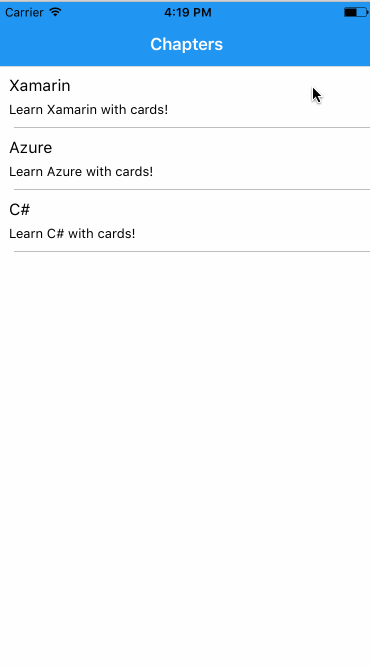

# XamarinFlashCards
Hey there,

Here is a little app I created for the interview at Xamarin team. I wanted to learn more about Xamarin, Azure, and C# so built Xamarin Flash Cards for iOS that provides with a variety of technical questions. The app contains the list of topics and flashcards with questions on each of them. Feel free to extend Xamarin Flash Cards or use not only for Xamarin!

The app is a cloud-ready. The storage interface is async; Just throw in web implementation and Azure backend. 

Built with Xamarin.Forms :monkey_face:
  
<table>
   <tr>
     <td></td>
   </tr>
</table>

#### Roadmap
* Windows app;
* Android app;
* Azure backend;
* More chapters;
* More questions;
* Questions complexity levels;
* Scoring system;
* Leaderboard and social elements (Play with someone!);
* HR system based on the results;
* Integration with Xamarin University (!).
  
#### Contribution Guidelines

Xamarin Flash Cards is opened for contributions. When contribute please use [C# Style Guide](https://github.com/dvdsgl/csharp-in-style "C# Style Guide Repository") by @dvdsgl | [GitHub](https://github.com/dvdsgl)
